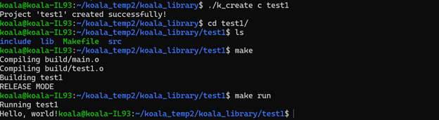
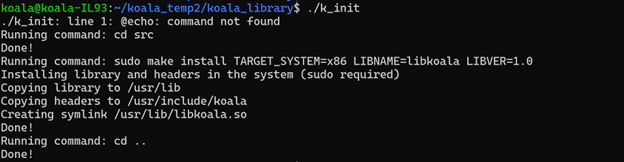
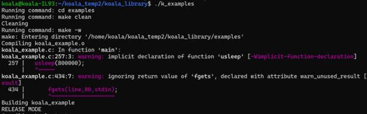
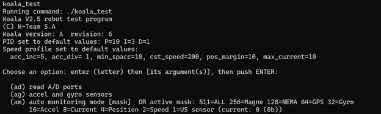

# koala2.5_manager

The "koala2.5_manager" is a collection of bash scripts to simplify the process of building libraries and projects for the Koala2.5 robot, supporting both C and C++ languages. The manager facilitates the setup and building of projects, making development more efficient for Koala2.5 robot projects.

## Contents

1. [k_create](#k_create)
2. [k_init](#k_init)
3. [k_examples](#k_examples)

## k_create

The `k_create` script creates a new project directory with the necessary structure and boilerplate files for C or C++ projects. It takes two arguments - the programming language ("c" or "cpp") and the project name.

Usage:

```bash
./k_create <language> <project_name>
```

Example:

```bash
./k_create cpp my_project
```

The script will create a new directory "my_project" with the following structure:

```
my_project/
|-- src/
|   |-- main.cpp (for C++ projects) OR main.c (for C projects)
|   |-- my_project.cpp (for C++ projects) OR my_project.c (for C projects)
|-- include/
|   |-- my_project.h
|-- lib/
|-- Makefile
```

## k_init

The `k_init` script sets up the build environment for Koala2.5 projects. It performs the following steps:

1. Navigates to the "src" directory.
2. Cleans build artifacts using `make clean`.
3. Builds the project using `make -w`.
4. Installs the library using `sudo make -w install TARGET_SYSTEM=x86 LIBNAME=libkoala LIBVER=1.0`.
5. Navigates back to the main directory.

Usage:

```bash
./k_init
```

## k_examples

The `k_examples` script simplifies the build and execution of examples in the "examples" directory. If no argument is provided, it will build all examples and list the executable files.



Usage:

```bash
./k_examples
```

If an argument (executable filename) is provided, it will build all examples, list the executable files, and execute the specified example.



Usage:

```bash
./k_examples koala_test
```

The script will execute the specified "my_example" if it exists in the "examples" directory and is executable.

---
