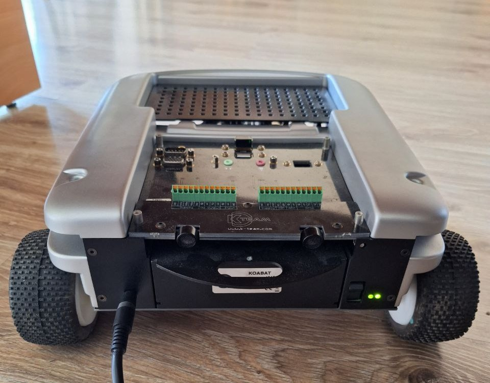

# koala2.5_manager

**Koala 2.5 Manager** is a utility script for creating and initializing C and C++ projects with the Koala library. It simplifies the setup process by generating project directories, source files, and a Makefile with the necessary build and run configurations. The manager facilitates the setup and building of projects, making development more efficient for Koala2.5 robot projects.

## Contents

1. [k_create](#k_create.sh)
2. [k_init](#k_init.sh)

## Requirements

- Bash (Bourne Again SHell)
- GCC (GNU Compiler Collection) for C projects
- G++ (GNU Compiler Collection) for C++ projects

## Usage

### k_create.sh


The `k_create.sh` script allows you to create a new C or C++ project with the Koala library.

```bash
Usage: k_create.sh <language> <project_name>

Parameters:
  <language>     : Use 'c' for C projects or 'cpp' for C++ projects.
  <project_name> : The name of the new project.
```

Example usage:

```bash
./k_create.sh c my_c_project
```

This will create a new C project named `my_c_project` with the necessary directory structure, source files, and a Makefile.

```bash
./k_create.sh cpp my_cpp_project
```

This will create a new C++ project named `my_cpp_project` with the necessary directory structure, source files, and a Makefile. To build and run `my_cpp_project` project:

```bash
cd my_cpp_project
make
make run
```

### k_init.sh


The `k_init.sh` script sets up the build environment, compiles the project, and installs the Koala library.

```bash
Usage: k_init.sh
```

The script will guide you through the build and installation process. Make sure you have the required build tools and permissions to install the library.

## Project Structure

The generated project directory structure will be as follows:

```
project_name/
├── src/
│   ├── main.c (or main.cpp for C++ projects)
│   ├── project_name.c (or project_name.cpp for C++ projects)
│   └── project_name.h
├── include/
│   └── project_name.h
├── lib/
│   ├── libkoala.so
│   ├── libkoala.a
│   └── libkoala.so.1.0
└── Makefile
```

- `src/`: Contains the source files for the main program and the project-specific code.
- `include/`: Contains the header files for the project.
- `lib/`: Contains the Koala library files.
- `Makefile`: The Makefile that automates the build process.
