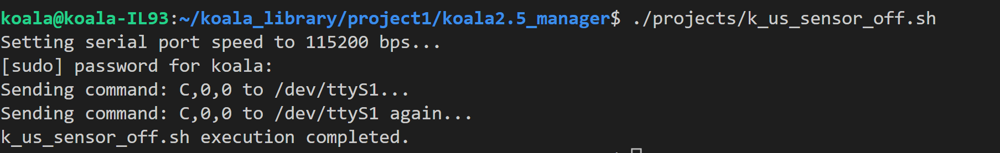

# k_us_sensor_off.sh

This script is designed to disable the ultrasonic sensors on the Koala2.5 mobile robot. The script sets the serial port speed, sends specific commands to the robot's serial port (/dev/ttyS1), and effectively turns off the ultrasonic sensors.

### Prerequisites

Before running this script, ensure you have the following:

- Koala2.5 mobile robot with ultrasonic sensors.
- Appropriate access rights to interact with the robot's serial port.

### Usage

1. Open a terminal or command prompt.
2. Navigate to the `projects` directory where the `k_us_sensor_off.sh` script is located.

```bash
cd projects/
```

3. Make sure the script has execution permissions.

```bash
chmod +x k_us_sensor_off.sh
```

4. Execute the script.

```bash
./k_us_sensor_off.sh
```

### Script Overview

The script performs the following steps:

1. **Setting Serial Port Speed**: The script configures the speed of data transmission on the `/dev/ttyS1` port to 115200 bps using `stty`.

2. **Sending Command**: The script sends the command "C,0,0" to the `/dev/ttyS1` port, effectively turning off the ultrasonic sensors. This command may have a specific meaning or functionality on the Koala2.5 robot, which should be documented in the robot's user manual or reference guide.

3. **Sending Command Again (Optional)**: The script sends the same command "C,0,0" again to the `/dev/ttyS1` port. This step is optional and may be necessary depending on the robot's requirements.

4. **Completion Message**: Once the script execution is completed, it will print the message "k_us_sensor_off.sh execution completed."

### Screenshot

